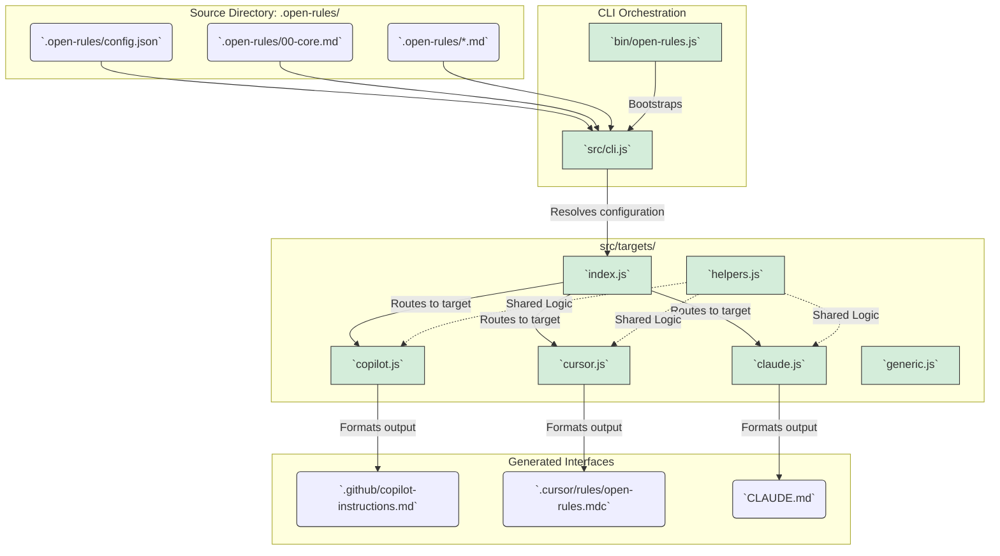
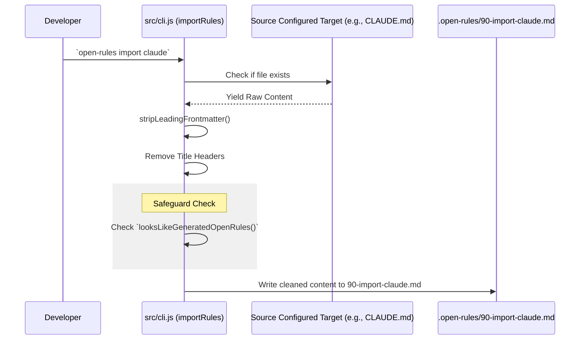

# Architecture Overview

The `open-rules` application runs as a Node.js CLI tool. It emphasizes a unidirectional data flow from a centralized rules directory out to target-specific artifact files.

## High-Level Component Model

## The Sync Data Flow

The primary operation of the project is the `sync` command. Its data flow is strictly step-by-step:

1. **Config Loading**: `loadConfig()` reads `.open-rules/config.json`, merging it tightly over a set of sensible default configurations.
2. **File Discovery**: `listRuleFiles()` performs a recursive filesystem traversal on `.open-rules/`, yielding all valid input files aligned with configured inclusion extensions and exclusions.
3. **Lexical Sorting**: Rules are sorted lexicographically by their relative path length (e.g. `00-core.md` comes before `90-copilot.md`). This guarantees reproducible outputs and allows prioritization.
4. **Content Aggregation**:
   - `buildMergedRules()`: Returns the complete concatenated multi-markdown output.
   - `buildReferencedRules()`: Returns a list of pointer references for environments supporting file linking.
5. **Target Rendering Execution**: Iteration over mapped targets. The renderer corresponding to the target is extracted from `src/targets/index.js` and fed the configurations.
6. **Output generation**: Synchronous file-writes commit changes to the destination paths.

## Import Data Flow

To support onboarding to `open-rules`, the `import` tool operates in reverse.

